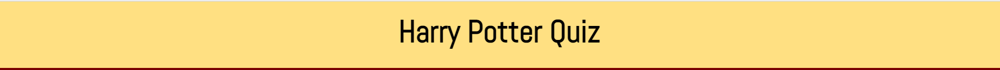
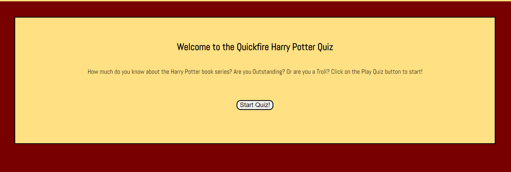
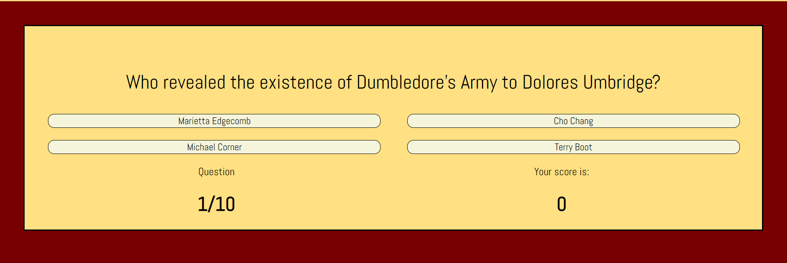
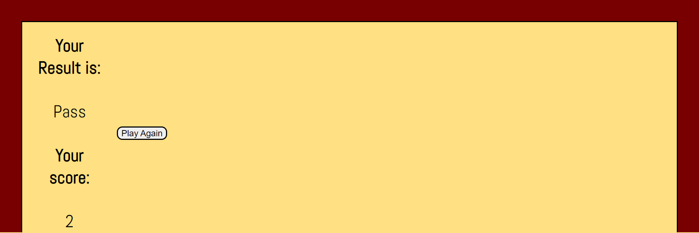
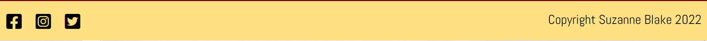

##Harry Potter Quiz

This quickfire Harry Potter quiz is a short quiz website with questions about the Harry Potter book series. The site is targeted towards fans of Harry Potter who want to test their knowledge and receive a result based on the grading system in the books themselves. The quiz takes the format of a question with 4 multiple choice answers. It is a fully responsive JavaScript game.

###Responsive MockUp
    ![Image for website responsiveness on desktop]
    ![Image for website responsiveness on phone]
    ![Image for website responsiveness on tablet]

###User Experience

####User Stories
* Visitor Goals
    a. As a visitor, I want to understand the main purpose of the site.
    b. As a visitor, I want to be able to navigate easily around the site and start the quiz.
    c. As a visitor, I want to be able to read the question and see relevant answers.
    d. As a visitor, I want to be able to answer the question and know that the site recognises my choice.
    e. As a visitor, I want to be able to see how many questions I have answered and see my current score.
    f. As a visitor, I want to be able to get my final result when the quiz is finished.
    g. As a visitor, I want to be able to easily get in contact with the site creator in case I have any issues with the site.

####Design
* Colour Scheme
    * The two main colours used are Red and Yellow. Red and yellow are synonomous with the Harry Potter series so they are good choices for the purpose of this website. 
* Typography
    * The Abel font is the main font used throughout the website with Sans Serif as the fallback font in case the font isn't being imported to the site correctly. It is clean, simple and easy to read and is similar to the original font associated with Harry Pooter.
* Wireframes
    * 
    * 
    * 

###Features
####Heading

*The heading appears at the top of the page
*If a user clicks the heading, they can return to the Welcome Area

####Welcome Area and Start Button

*The welcome area welcomes the user to the site
*The user can start the quiz by clicking the Start Button

####Question Area and Score Area

*This area contains the question and 4 possible answers.
*Once the user clicks on an answer, they will be taken to the next question.
*If the user clicks the correct answer, the background on that answer turns green.
*If the user clicks the incorrect answer, the background on that answer turns red.
*The score area shows the user's score.

*The score area also shows how many questions the user has answered out of 10.

####Results Area and Play Again Button

*

####Footer

###Testing

####Validator Testing

####Unfixed Bugs

###Deployment

###Credits

####Content

####Media

Favicon from http://clipart-library.com/images_k/lightning-bolt-transparent-background/lightning-bolt-transparent-background-24.png

CSS grid help: css-tricks.com and https://codepen.io/mogpt/pen/ebXdzg